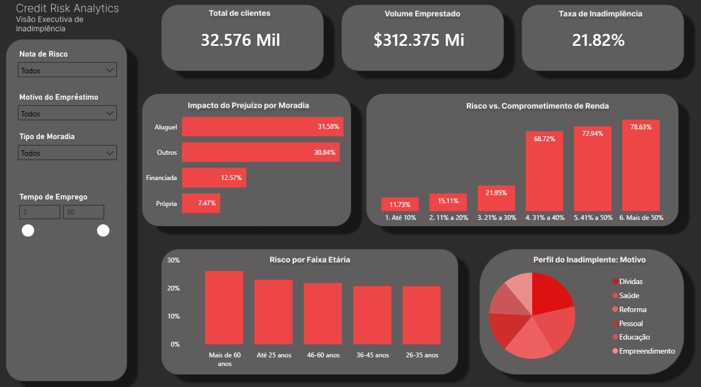

# 📊 Credit Risk Analytics | Análise Exploratória e Visão Executiva

## 📖 O Problema de Negócio (O Desafio)
Em instituições financeiras, a inadimplência não é apenas um erro na planilha; é o ralo por onde o lucro da empresa escorre. Para combater isso, os gestores precisam entender o comportamento da sua carteira de clientes.

O objetivo deste projeto foi atuar como um **Analista de Dados**, recebendo uma base bruta de concessão de crédito para realizar uma profunda **Análise Exploratória de Dados (EDA)**. A missão era limpar o ruído, cruzar variáveis e extrair inteligência de negócios para responder a uma pergunta central: **Quais são os fatores comportamentais e financeiros que mais explicam o calote em nossa base atual?**

## 💡 A Solução (O Projeto)
Para resolver esse problema, estruturei um processo analítico focado em descoberta, tratamento e visualização da informação:

1. **Exploração e Limpeza (Python):** Utilizei Pandas e Seaborn para mergulhar na base de dados, entender a distribuição das variáveis, tratar inconsistências/valores nulos e mapear as correlações matemáticas entre o perfil do cliente e a taxa de calote. O foco foi transformar dados brutos em um terreno sólido e confiável.
2. **Inteligência de Negócios (Power BI):** Construí um painel de controle (Dashboard) executivo e dinâmico usando DAX. O objetivo foi entregar à Diretoria de Risco uma ferramenta onde eles pudessem fatiar os dados, aplicar filtros e identificar zonas de perigo de forma visual e imediata.

## 🎯 5 Insights de Negócio Descobertos na Exploração
Durante a análise exploratória, os dados revelaram comportamentos que quebram alguns mitos do mercado:

1. **A Ilusão da Idade:** Embora clientes mais velhos apresentem taxas relativas altas de inadimplência, o verdadeiro impacto financeiro no caixa do banco vem dos clientes **Até 25 anos**, que representam um volume massivo de calotes absolutos.
2. **O Ponto de Ruptura Financeira:** A análise provou que aprovar parcelas que comprometam **mais de 30% da renda** do cliente faz a taxa de calote disparar exponencialmente para níveis insustentáveis.
3. **O Dreno do Portfólio:** Ao isolar os grupos, ficou claro que clientes que moram de **Aluguel** são os principais responsáveis por carregar o prejuízo da instituição.
4. **A Anatomia do Calote:** Analisando apenas a base de maus pagadores, quase metade deles buscou crédito por motivos de desespero financeiro ("Saúde" e "Dívidas").
5. **Os Motores do Risco:** A matriz de correlação estatística revelou que fatores como tempo de emprego e uma renda anual robusta atuam como os maiores "freios" naturais contra o risco de crédito.

## 🚀 Plano de Ação e Impacto no Negócio (Recomendações)
Como este é um projeto de análise de dados focado em extrair inteligência de uma base histórica, o próximo passo lógico é transformar esses *insights* em políticas de crédito. 

Se as descobertas deste painel fossem aplicadas hoje na esteira de aprovação da instituição, as recomendações estratégicas seriam:

1. **Implementação de "Hard Stop" em 30%:**
   * **Ação:** Bloquear automaticamente ou exigir aprovação gerencial dupla para qualquer solicitação de crédito onde a parcela comprometa mais de 30% da renda do cliente.
   * **Impacto Esperado:** Redução drástica da "linha da morte" da inadimplência, estancando a concessão de crédito para o grupo de maior risco da carteira, o que refletiria diretamente na redução da Provisão para Créditos de Liquidação Duvidosa (PDD).

2. **Revisão de Precificação (Pricing) por Moradia:**
   * **Ação:** Ajustar o motor de crédito para cobrar uma taxa de juros ligeiramente maior ou exigir garantias adicionais para clientes que moram de "Aluguel", subsidiando o risco.
   * **Impacto Esperado:** Proteção do caixa do banco. Como este grupo concentra a maior parte do prejuízo absoluto, o ajuste na taxa compensa a perda esperada.

3. **Novo Produto para a Geração Z (Até 25 anos):**
   * **Ação:** Em vez de negar crédito aos jovens (que representam o futuro do banco, mas hoje são o maior volume de calote), criar uma "Trilha de Crédito Educativa". Aprovar limites iniciais muito baixos e ir aumentando apenas mediante um histórico de meses sem atraso.
   * **Impacto Esperado:** Fidelização do cliente jovem sem expor o banco ao risco de limites altos que eles estatisticamente não conseguem pagar.

4. **Fila de Prioridade na Cobrança:**
   * **Ação:** Usar os dados de "Motivo do Empréstimo" na equipe de renegociação. Clientes que pegaram dinheiro para "Saúde" ou "Consolidação de Dívidas" devem receber propostas de renegociação mais amigáveis e com prazos alongados antes que o atraso vire calote definitivo.
   * **Impacto Esperado:** Aumento na taxa de recuperação de crédito, abordando o cliente no tom certo e no momento certo.
     
## 🛠️ Stack Tecnológica
* **Python** (Pandas, Matplotlib, Seaborn): Para limpeza de dados e Análise Exploratória (EDA).
* **Power BI & DAX:** Para criação de métricas calculadas (Taxa de Inadimplência) e visualização de dados (*Data Visualization*).
* **Jupyter Notebook:** Para documentação detalhada do raciocínio analítico.

## 👨‍💻 Sobre o Autor
Como um estudante de Análise e Desenvolvimento de Sistemas apaixonado por transformar números em estratégias claras, desenvolvi este projeto para demonstrar minha capacidade de realizar Análises Exploratórias completas e criar visualizações de alto impacto. Meu foco é me consolidar na carreira de Analista de Dados / Business Intelligence, construindo painéis e relatórios que ajudem empresas a tomar decisões mais inteligentes.

---
*Gostou da exploração? Sinta-se à vontade para se conectar comigo no [LinkedIn](https://www.linkedin.com/in/cauan-ferreira/) ou entre no meu blog de [finanças](https://investirsemmedo.com.br/) se quiser saber mais sobre o que eu faço, aprofunde-se no código fonte na pasta `notebooks` deste repositório.*
